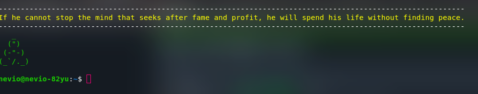

# Get Buddah in your terminal

<span style="color:red">
Bc the API is currently or forever not availibel this project dosent work so please dont install it right know it will not work
</span>.

```
       _=_	A simple programm that gives you a nice qwote each time your open your terminal
     q(-_-)p
     '_) (_`
     /__/  \
   _(<_   / )_
  (__\_\_|_/__)

```

---
# Installation


1.  clone repo
  ```bash
  git clone https://github.com/Nevio-Source/get_buddah.git
  cd get_buddah
  ./install.sh
  ```

 2.  enjoy buddah in your terminal

---
# Uninstall

```bash
./uninstall.sh
```
---

#  Screen-Shots




